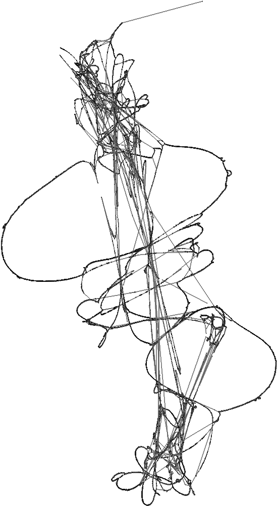
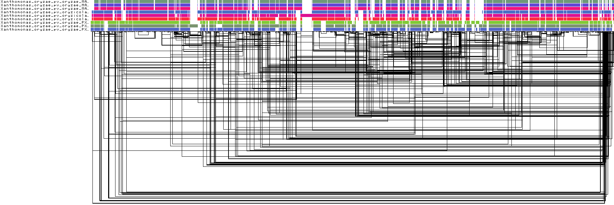

# PanExplorer_workflow

# About

This workflow is a snakemake worklow that can be run in the backend of the PanExplorer web application.

**Homepage:** [https://panexplorer.southgreen.fr/](https://panexplorer.southgreen.fr/)

It allows to perform a pan-genome analysis using published and annotated bacteria genomes, using different tools that can be invoked: Roary, PGAP, PanACoTA.

It provides a presence/absence matrix of genes, an UpsetR Diagram for synthetizing the matrix information and a COG assignation summary for each strain.


## Citation

[https://doi.org/10.1093/bioinformatics/btac504](https://doi.org/10.1093/bioinformatics/btac504)

## Authors

* Alexis Dereeper (IRD)

## Prerequisites - Tool dependencies

Using a singularity container, the only dependency you will need is **singularity**.

This singularity image (panexplorer.sif) already contains all dependencies required for running the workflow:

- Snakemake
- Roary
- PGAP
- Panaroo
- Panacota
- Minigraph/cactus
- PanGenome Graph Builder (PGGB)
- ncbi-blast+ (version BLAST 2.4.0+)
- R (version 4.2.0) and following packages:
  - optparse : ``install.packages("optparse")``
  - dendextend : ``install.packages("dendextend")``
  - svglite : ``install.packages("svglite")``
  - heatmaply : ``install.packages("heatmaply")``
  - gplots : ``install.packages("gplots")``
  - UpSetR : ``install.packages("UpSetR")``

## Install

1- Git clone

```
git clone https://github.com/SouthGreenPlatform/PanExplorer_workflow.git
```

2- Define the PANEX_PATH environnement variable

```
cd PanExplorer_workflow
export PANEX_PATH=$PWD
```

3- Get preformatted RPS-BLAST+ database of the CDD COG distribution

```
wget https://ftp.ncbi.nlm.nih.gov/pub/mmdb/cdd/little_endian/Cog_LE.tar.gz
tar -xzvf Cog_LE.tar.gz -C $PANEX_PATH/COG
```

4- Get the singularity container

```
wget -P $PANEX_PATH/singularity https://panexplorer.southgreen.fr/singularity/panexplorer.sif
```


## Prepare your list of genomes to be analyzed

Edit the configuration file config.yaml to list the Genbank identifiers of complete assembled and annotated genomes.
```
#########################################################
# Complete one of the following input data
# Remove the other lines if not needed
#########################################################

# Genbank accessions of assembly accession (GCA, GCF)
ids:
  - GCA_001042775.1
  - GCA_001021915.1
  - GCA_022406815.1

# Path of genbank files
input_genbanks:
  - data/GCA_001518895.1.gb
  - data/GCA_001746615.1.gb
  - data/GCA_003382895.1.gb

# Input genomes as fasta and annotation files in GFF format
# Only applied when using Orthofinder or PGGB workflows, starting from fasta and GFF
# To be used preferentially for eukaryotes
input_genomes:
  "MSU7":
    "fasta": "/share/banks/Oryza/sativa/japonica/MSU7/all.con"
    "gff3": "/share/banks/Oryza/sativa/japonica/MSU7/all.gff3"
    "name": "MSU7"
  "kitaake":
    "fasta": "/share/banks/Oryza/sativa/japonica/kitaake/Oryza_sativa_japonica_Kitaake.assembly.fna"
    "gff3": "/share/banks/Oryza/sativa/japonica/kitaake/Oryza_sativa_japonica_Kitaake.gff3"
    "name": "kitaake"
  "nivara":
    "fasta": "/share/banks/Oryza/nivara/Oryza_nivara.assembly.fna"
    "gff3": "/share/banks/Oryza/nivara/Oryza_nivara.gff3"
    "name": "nivara"

identity: 80
```

It's best not to mix NCBI genomes with your own annotated genomes, to avoid biaises due to annotation method/software. Keep an homogeneous annotation procedure to feed the workflow.

## Run the workflow

**For prokaryotes**

Creating a pangenome using Roary

```
singularity exec $PANEX_PATH/singularity/panexplorer.sif snakemake --cores 1 -s $PANEX_PATH/Snakemake_files/Snakefile_wget_roary_heatmap_upset_COG
```

Creating a pangenome using PanACoTA

```
singularity exec $PANEX_PATH/singularity/panexplorer.sif snakemake --cores 1 -s $PANEX_PATH/Snakemake_files/Snakefile_wget_panacota_heatmap_upset_COG
```

Creating a pangenome graph using Minigraph/Cactus and derived pangenes matrix

```
singularity exec $PANEX_PATH/singularity/panexplorer.sif snakemake --cores 1 -s $PANEX_PATH/Snakemake_files/Snakefile_wget_cactus_heatmap_upset_COG
```

Creating a pangenome graph using PanGenomeGraph Builder (PGGB) and derived pangenes matrix

```
singularity exec $PANEX_PATH/singularity/panexplorer.sif snakemake --cores 1 -s $PANEX_PATH/Snakemake_files/Snakefile_wget_pggb_heatmap_upset_COG
```

**For eukaryotes**

Creating a pangenome using Orthofinder

```
singularity exec $PANEX_PATH/singularity/panexplorer.sif snakemake --cores 1 -s $PANEX_PATH/Snakemake_files/Snakefile_orthofinder_heatmap_upset
```

## Graphical outputs

In all cases, you should a new directory named "outputs" containing all output files.

In case of a pangenome graph analysis with PGGB, you will obtain vizualizations of the graph (using ODGI)

* **2D graph visualization** : outputs/pggb_out/all_genomes.fa.lay.draw.png

 

* **1D graph visualization** : outputs/pggb_out/all_genomes.fa.og.viz_multiqc.png

 


In all cases, it also includes:

* **ANI (Average Nucleotide Identity)** : outputs/fastani.out.svg

The heatmap chart generated from distances calculated based on the ANI values. 
ANI values are calcultaed using FastANI software.

 
 
* **Presence/absence matrix of accessory genes**: outputs/heatmap.svg.complete.new.svg

Both gene clusters and samples have been ordered using a Hierarchical Clustering.
 
 

* **Upset plot**: outputs/upsetr.svg

An Upset plot is an alternative to the Venn Diagram used to deal with more than 3 sets.
The total size of each set is represented on the left barplot.
Every possible intersection is represented by the bottom plot, and their occurence is shown on the top barplot.
Each row corresponds to a possible intersection: the filled-in cells show which set is part of an intersection.

 

* **Rarefaction curve**: outputs/rarefaction_curves.svg

The rarefaction curve (computed by micropan R package) is the cumulative number of gene clusters we can observe as more and more genomes are being considered.

 
 

## License

GNU General Public GPLv3 License
