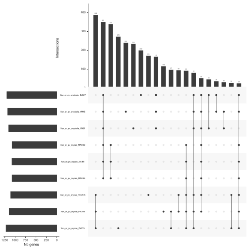
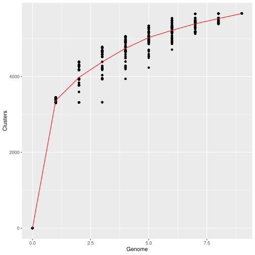

# PanExplorer_workflow

# About

This workflow is a snakemake worklow that can be run in the backend of the PanExplorer web application.

**Homepage:** [https://panexplorer.southgreen.fr/](https://panexplorer.southgreen.fr/)

It allows to perform a pan-genome analysis using published and annotated bacteria genomes, using different tools that can be invoked: Roary, PGAP, PanACoTA.

It provides a presence/absence matrix of genes, an UpsetR Diagram for synthetizing the matrix information and a COG assignation summary for each strain.


## Citation

[https://doi.org/10.1093/bioinformatics/btac504](https://doi.org/10.1093/bioinformatics/btac504)

## Authors

* Alexis Dereeper (IRD)

## Prerequisites - Tool dependencies

- Snakemake
- Roary
- PGAP
- Panaroo
- ncbi-blast+ (version BLAST 2.4.0+)
- R (version 4.2.0) and following packages:
  - optparse : ``install.packages("optparse")``
  - dendextend : ``install.packages("dendextend")``
  - svglite : ``install.packages("svglite")``
  - heatmaply : ``install.packages("heatmaply")``
  - gplots : ``install.packages("gplots")``
  - UpSetR : ``install.packages("UpSetR")``

## Install

1- Git clone

```
git clone https://github.com/SouthGreenPlatform/PanExplorer_workflow.git
```

2- Define the PANEX_PATH environnement variable

```
cp -rf PanExplorer_workflow /usr/local/bin
export PANEX_PATH=/usr/local/bin/PanExplorer_workflow
```

3- Get preformatted RPS-BLAST+ database of the CDD COG distribution

```
wget https://ftp.ncbi.nlm.nih.gov/pub/mmdb/cdd/little_endian/Cog_LE.tar.gz
tar -xzvf Cog_LE.tar.gz
cp -rf Cog.* $PANEX_PATH/COG
```

## Prepare your list of genomes to be analyzed

Edit a new file named "genbank_ids" listing the Genbank identifiers of complete assembled and annotated genomes.
The file should look like this
```
cat genbank_ids
CP000235.1
CP001759.1
CP015994.2
```

Edit another new file named "genbank_files" listing the path to your own assembled and annotated genomes.
The file should look like this
```
cat genbank_files
/home/myname/genbank_files_dir/CP006617.1.genbank.gb
/home/myname/genbank_files_dir/CP001079.1.genbank.gb
```


## Run the workflow

Creating a pangenome using Roary

```
snakemake --cores 1 -s $PANEX_PATH/Snakemake_files/Snakefile_wget_roary_heatmap_upset_COG
```

Creating a pangenome using PanACoTA

```
snakemake --cores 1 -s $PANEX_PATH/Snakemake_files/Snakefile_wget_panacota_heatmap_upset_COG
```

Creating a pangenome using PGAP

```
snakemake --cores 1 -s $PANEX_PATH/Snakemake_files/Snakefile_wget_PGAP_heatmap_upset_COG
```

In all cases, you should a new directory named "outputs" containing all output files.

This includes:

* ANI (Average Nucleotide Identity) : images/fastani.out.svg

The heatmap chart generated from distances calculated based on the ANI values. 
ANI values are calcultaed using FastANI software.

 
 
 Presence/absence heatmap of accessory genes:
 
 

 Upset plot

 

 Rarefaction curves

 
## License

GNU General Public GPLv3 License
